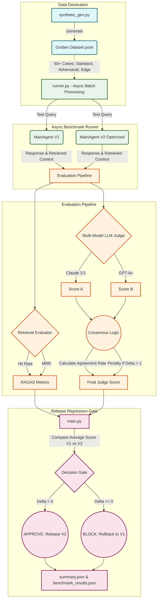

# AI Evaluation Factory Workflow

Dưới đây là sơ đồ kiến trúc và luồng xử lý (workflow) của hệ thống tự động đánh giá mà chúng ta đã xây dựng trong dự án Lab 14:

### Giải thích quy trình xử lý:
1. **Bước 1 (Data Generation):** Sinh tự động tập dữ liệu `golden_set` gồm 50 cases đa dạng.
2. **Bước 2 (Async Processing):** Chạy song song hàng loạt test cases trên cả cụm Agent V1 và V2 nhằm tiết kiệm thời gian và tránh timeouts.
3. **Bước 3 (Evaluation):**
   - **RAG Retrieval:** Công cụ đánh giá Hit Rate và MRR để xác nhận Vector DB có bốc được đúng đoạn văn bản cần tìm không.
   - **Multi-Judge consensus:** Cả mô hình GPT-4o và Claude 3.5 đều chấm điểm độc lập. Nút Consensus (đồng thuận) sẽ tính điểm theo trung bình chung, đồng thời phạt nặng nếu hai kết quả lệch xa nhau.
4. **Bước 4 (Gate Check):** So sánh hiệu năng của bản cập nhật (V2) với bản hiện tại (V1). Nếu chất lượng tăng (*Delta > 0*), hệ thống cấp phép Deploy và xuất report.
